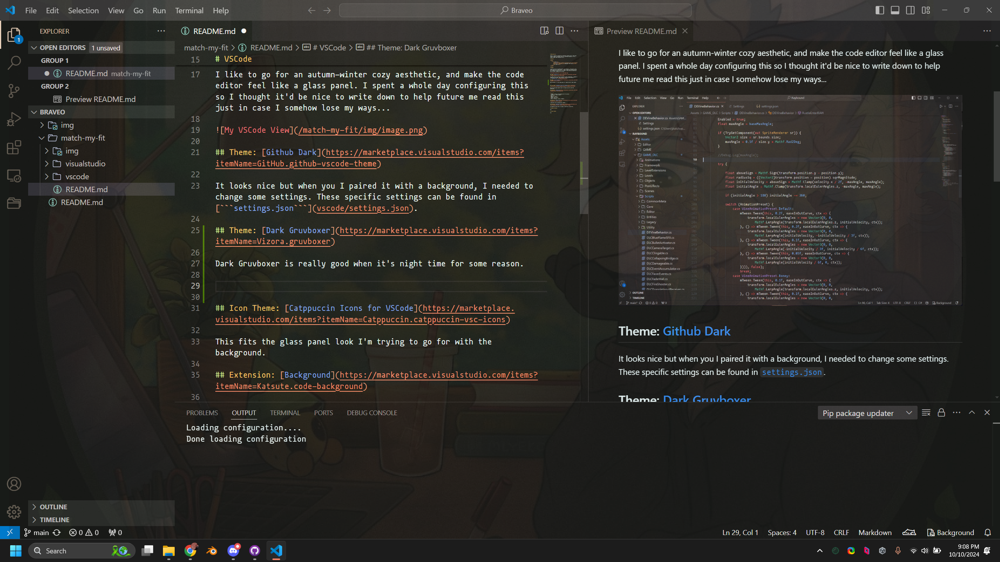
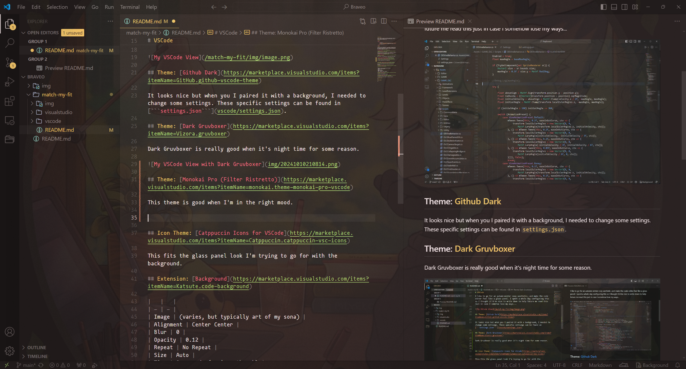

# Match My Fit

There's a bunch of settings for different software that I keep here incase I need to reinstall stuff on a different machine, or if I simply forget what settings to set...

# General

<table>
    <tr>
        <td>Font</td>
        <td><a href="https://github.com/ryanoasis/nerd-fonts/releases/download/v3.2.1/Mononoki.zip">Mononoki (Nerd Font)</a></td>
        <td>I like it</td>
    </tr>
</table>

# VSCode

I like to go for an autumn-winter cozy aesthetic, and make the code editor feel like a glass panel. I spent a whole day configuring this so I thought it'd be nice to write down to help future me read this just in case I somehow lose my ways...

## Theme: [Github Dark](https://marketplace.visualstudio.com/items?itemName=GitHub.github-vscode-theme)

It looks nice but when you I paired it with a background, I needed to change some settings. These specific settings can be found in [```settings.json```](vscode/settings.json).


## Theme: [Dark Gruvboxer](https://marketplace.visualstudio.com/items?itemName=Vizora.gruvboxer)

Dark Gruvboxer is really good when it's night time for some reason.



## Theme: [Monokai Pro (Filter Ristretto)](https://marketplace.visualstudio.com/items?itemName=monokai.theme-monokai-pro-vscode)

This theme is good when I'm in the right mood.



## Icon Theme: [Catppuccin Icons for VSCode](https://marketplace.visualstudio.com/items?itemName=Catppuccin.catppuccin-vsc-icons)

This fits the glass panel look I'm trying to go for with the background.

## Extension: [Background](https://marketplace.visualstudio.com/items?itemName=Katsute.code-background)

|   |   |
| - | - |
| Image | (varies, but typically art of my sona) |
| Alignment | Center Center |
| Blur | 0 |
| Opacity | 0.12 |
| Repeat | No Repeat |
| Size | Auto |
| Time | 0 seconds (varies, though) |

## Extension: [Bongo Cat](https://marketplace.visualstudio.com/items?itemName=pixl-garden.BongoCat)

I need this cat to motivate me, please...

## Extension: [Markdown Paste](https://marketplace.visualstudio.com/items?itemName=telesoho.vscode-markdown-paste-image)

It helped me write this so I guess it deserves a spot here.

# Windows Terminal

N/A

# Visual Studio

N/A